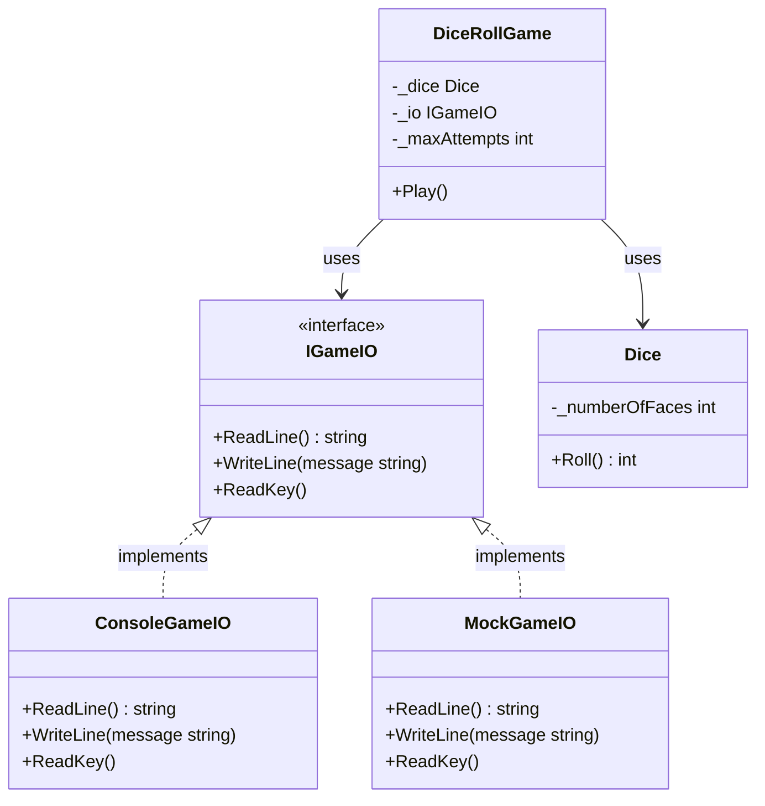
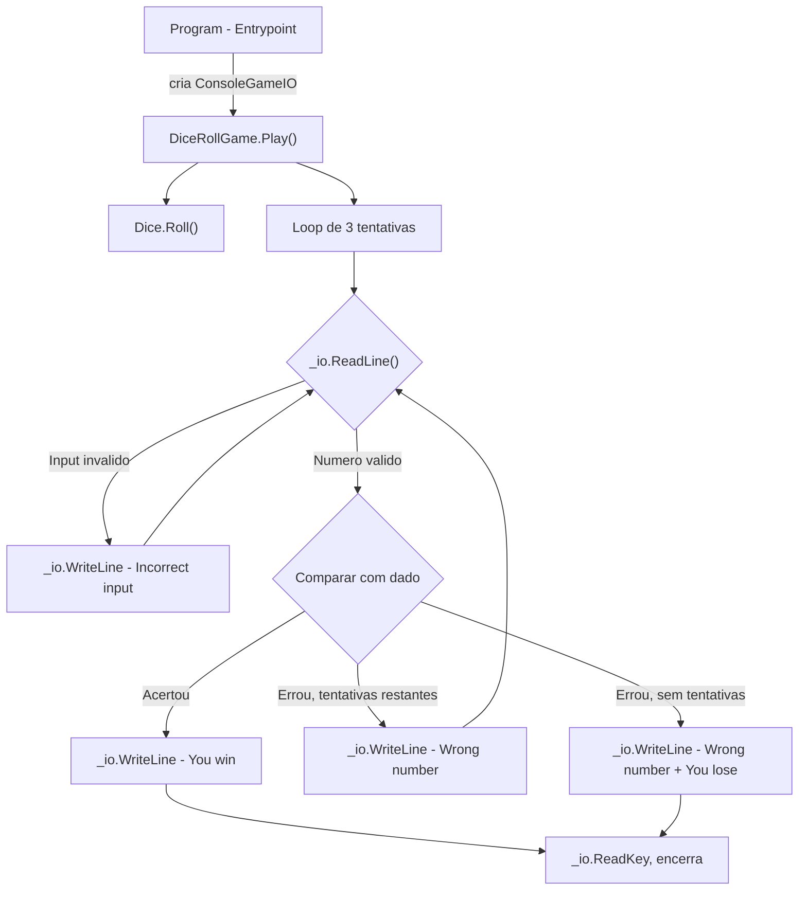

# Plano de Implementacao - Dice Roll Game (com Testabilidade)

## Arquitetura

O jogo usa **Dependency Inversion**: a classe `DiceRollGame` nao depende diretamente do console, mas sim de uma interface `IGameIO`. Isso permite injetar um mock nos testes unitarios.







## Estrutura de Arquivos

- `IGameIO.cs` - Interface para entrada/saida (nova)
- `ConsoleGameIO.cs` - Implementacao real usando `Console` (nova)
- `Dice.cs` - Classe `Dice` (ja existe, precisa correcao)
- `DiceRollGame.cs` - Classe com logica do jogo, recebe `IGameIO` (nova)
- `Program.cs` - Entrypoint com top-level statements

## Detalhes de Implementacao

### 1. Criar `IGameIO.cs` - Interface de I/O

Interface que abstrai todas as operacoes de entrada e saida:

```csharp
public interface IGameIO
{
    string? ReadLine();
    void WriteLine(string message);
    void ReadKey();
}
```

### 2. Criar `ConsoleGameIO.cs` - Implementacao para Console

Implementacao concreta que delega para `System.Console`:

```csharp
public class ConsoleGameIO : IGameIO
{
    public string? ReadLine() => Console.ReadLine();
    public void WriteLine(string message) => Console.WriteLine(message);
    public void ReadKey() => Console.ReadKey();
}
```

### 3. Corrigir `Dice.cs`

O arquivo ja existe mas tem conflito de construtores (construtor primario vazio `Dice()` + construtor com parametro). Corrigir removendo o construtor primario e adicionando `readonly`:

```csharp
public class Dice
{
    private readonly int _numberOfFaces;

    public Dice(int numberOfFaces)
    {
        _numberOfFaces = numberOfFaces;
    }

    public int Roll()
    {
        Random random = new Random();
        return random.Next(1, _numberOfFaces + 1);
    }
}
```

### 4. Criar `DiceRollGame.cs`

Classe com a logica principal do jogo, recebendo `IGameIO` por **injecao de dependencia no construtor**:

- **Campos**: `Dice _dice`, `IGameIO _io`, `int _maxAttempts` (3)
- **Construtor**: `DiceRollGame(IGameIO io)` - recebe a implementacao de I/O
- **Metodo `Play()**`: Orquestra o fluxo completo:
  1. Rola o dado e armazena o resultado
  2. Chama `_io.WriteLine("Dice rolled. Guess what number it shows in 3 tries.")`
  3. Entra no loop de tentativas (max 3)
  4. Em cada iteracao:
    - Chama `_io.WriteLine("Enter number:")`
    - Le input via `_io.ReadLine()`
    - Se input invalido (nao e inteiro via `int.TryParse`): `_io.WriteLine("Incorrect input")`, **nao** consome tentativa, volta ao inicio do loop
    - Se numero correto: `_io.WriteLine("You win")`, `_io.ReadKey()`, retorna
    - Se numero incorreto e ainda ha tentativas: `_io.WriteLine("Wrong number")`, continua
    - Se numero incorreto e era a ultima tentativa: `_io.WriteLine("Wrong number")`, `_io.WriteLine("You lose")`, `_io.ReadKey()`, retorna

### 5. Atualizar `Program.cs`

Simplificar para apenas o entrypoint, injetando `ConsoleGameIO`:

```csharp
var io = new ConsoleGameIO();
var game = new DiceRollGame(io);
game.Play();
```

## Como Usar em Testes Unitarios (futuro)

Com essa arquitetura, voce podera criar um `MockGameIO` que simula inputs e captura outputs:

```csharp
public class MockGameIO : IGameIO
{
    private readonly Queue<string?> _inputs;
    public List<string> Outputs { get; } = new();

    public MockGameIO(params string?[] inputs)
    {
        _inputs = new Queue<string?>(inputs);
    }

    public string? ReadLine() => _inputs.Dequeue();
    public void WriteLine(string message) => Outputs.Add(message);
    public void ReadKey() { }
}
```

Exemplo de teste:

```csharp
// Arrange - simula usuario digitando "3" (supondo dado = 3)
var mock = new MockGameIO("3");
var game = new DiceRollGame(mock);

// Act
game.Play();

// Assert
Assert.Contains("You win", mock.Outputs);
```

## Regras de Negocio Importantes (dos requirements)

- **Numero correto**: "You win" + espera tecla + fecha
- **Numero errado, ainda tem tentativas**: "Wrong number" + pede novo numero
- **Numero errado, 3a tentativa usada**: "Wrong number" + "You lose" + espera tecla + fecha
- **Input invalido (ex: "abc", vazio)**: "Incorrect input" + pede novo numero, **sem perder tentativa**
- **Numero fora de 1-6 mas valido (ex: 10)**: Conta como tentativa errada normal ("Wrong number")

